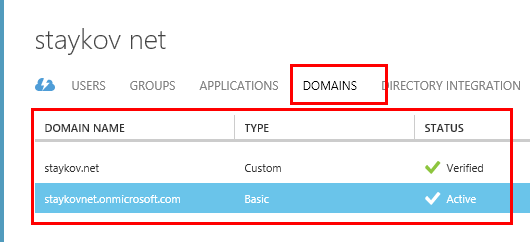
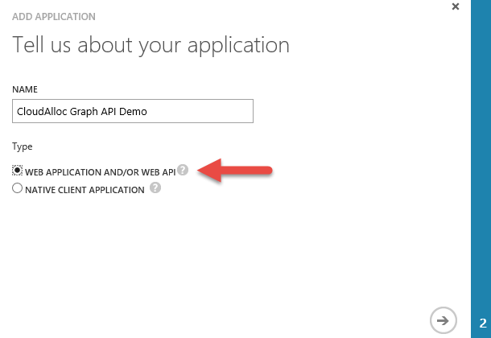
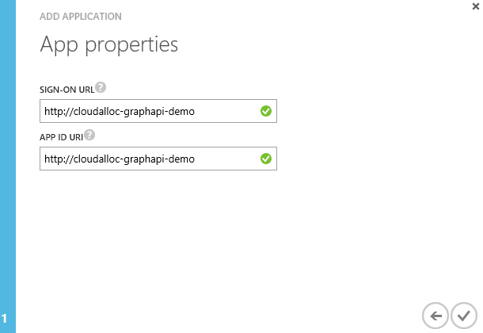
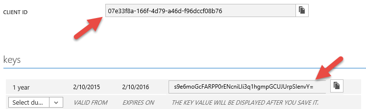
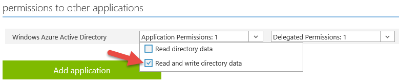

# Ansible Python Role to create and delete users in Azure AD

This Ansible Role is to create users in Azure AD.

You will need a Client ID, Client Secret and your Tenent Domain.

Your Tenent Domain is usually to be found under the Domain TAB in your Azure AD Domain portal. It should be something .onmicrosoft.com



REGISTER A NEW APPLICATION IN AZURE AD

The first step is to register an application in Azure AD. This is done in the APPLICATIONS page of your directory in the Azure Management Portal. Click on the ADD button at the bottom of the page to proceed through the new application wizard.

The first page of the wizard as shown in Figure 3 needs a name for my application and the type of application it is. For this application, even though it is a console application, I am choosing the Web Application and/or Web API type. The reason I’m doing this is because I want my application to authenticate using application credentials rather than prompting the user running the application to authenticate with his/her username and password.



Figure 3: Registering an application in Azure AD

Since I chose the Web Application/Web API application type, the next page in the wizard needs a valid sign-in URL and application ID URI. Since this is not really a web application any values will work as long as they are valid URL’s and URI’s as shown here in Figure 4.



Figure 4: Azure AD Application Registration Properties

That completes the application registration part. Now I need to make a couple of configuration changes which I’ll do in the next section.

CONFIGURE THE APPLICATION TO ACCESS THE AZURE AD GRAPH

The configuration changes I need to make can be done in the CONFIGURE page for the application I registered using the Azure Management Portal. Shortly I’ll be getting into the code of the application and when I do there will be two pieces of information that I’m going to need. The first is the CLIENT ID which Azure AD generated for me when the application was registered. The other is a KEY (or secret) that I need to generate for my application so it can access the graph. Both of these are shown here in Figure 5. Pay attention to the message in the portal when you generate your key. As soon as you save the configuration change you will be able to see the key and copy it. After that, you will never be able to see it again so be sure to copy it before leaving the page. Otherwise, you will have to re-generate a new key. Also, notice that you can create multiple keys. This is to support key rollover scenarios. For example, as your key approaches expiration you can create a new key, update and deploy your code with the new key, and then remove the old key.



Figure 5: Client ID and Keys

A little further down in the permissions to other applications section, I am adding an Application Permission indicating this application can Read and write directory data as shown in Figure 6. This will allow my application to query the directory and make changes to it such as adding new users.



Figure 6: Setting permissions to access the Graph API

NOTE: It has been my experience that changes to permissions (application or delegated as shown above) generally take about 5 minutes to take effect. So for example, let’s assume I forgot to add the application permission above, built my application, and then realized my application didn’t have the required permissions to read the graph when I ran it. It’s a simple fix to come back here and add the permission. Just be aware that there is this delay. Otherwise, you may do like I did and start applying other unnecessary changes to try and get it working. Just be patient. 
Now, with these configuration changes saved, I’m ready to transition into the coding of this application.

REF: http://justazure.com/azure-active-directory-part-5-graph-api/

##This will let you only Create users, to be able to delete users you need to do the following:

Get a Windows box (as far as I know that's only possible using Powershell, that's why the Windows box)

Install the Azure AD Module

The Azure AD Module is supported on the following Windows operating systems with the default version of Microsoft .NET Framework and Windows PowerShell: Windows 8.1, Windows 8, Windows 7, Windows Server 2012 R2, Windows Server 2012, or Windows Server 2008 R2.
First install the [Microsoft Online Services Sign-In Assistant for IT Professionals RTW](http://go.microsoft.com/fwlink/?LinkID=286152) from the Microsoft Download Center. Then install the [Azure Active Directory Module for Windows PowerShell (64-bit version)](http://go.microsoft.com/fwlink/p/?linkid=236297), and click Run to run the installer package.

Connect to Azure AD

Click the shortcut to open a Windows PowerShell workspace that has the cmdlets. Alternatively, you can load the cmdlets manually by typing `import-module MSOnline` at the Windows PowerShell command prompt.

Before you can run any of the Azure cmdlets, you must first connect to your online service. To do so, run the cmdlet `connect-msolservice` at the Windows PowerShell command prompt. You will then be prompted for your credentials. If you want, you can supply your credentials in advance, for example:

```powershell
$msolcred = get-credential
connect-msolservice -credential $msolcred
```

The first command prompts for credentials and stores them as `$msolcred`. The next command uses those credentials as `$msolcred` to connect to the service.

Now all what you need to do is to add your Service Principal which you have created before for user creation to the role `User Account Administrator` however to do that, you will need to get its ObjectID.

Run the following PS command to get the ObjectID (Your Service Principal Name is the name you have choosen before - check Figure 3 above)

```powershell
Get-MsolServicePrincipal | where {$_.DisplayName -match "PUT A PART OF YOUR SERVICE PRINCIPAL NAME HERE"}
```

Note down the ObjectId and then run the following:

```powershell
add-msolrolmember -RoleName "User Account Administrator" -RoleMemberType ServicePrincipal -RolememberobjectID PUT_YOUR_OBJECT_ID_HERE
```

That's it! the deletion shold be working now ;-)

REF:

https://technet.microsoft.com/en-us/library/jj151815.aspx#bkmk_installmodule
http://blogs.msdn.com/b/dsadsi/archive/2013/11/26/how-to-create-a-service-principal-using-the-msol-cmdlets-for-use-with-the-waad-graph-api.aspx
